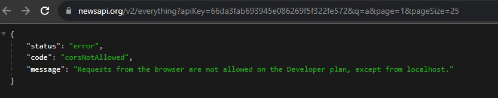

# RQ-NEWS 📰

Displays world news and caches them by pages until new data is fetched usding the React Query library.

Uses an API of the https://newsapi.org/

### Live Demo 🔴


- You can check it out by following <b><a href="https://serpo-dev.github.io/rq-news" target="_blank">this link</a></b> 🔗 :

`https://serpo-dev.github.io/rq-news/`

❗ In live demo the news list is not fetching, because the API blocks non-localhost requests. For trying the full mode you need to clone this repo and run it as a dev server on your local machine.

</img>

### Demo Pic 🖥️

</img>

### Usage 📙

1. Install the node packages:
```
npm install
```

2. Create `.env` file and insert variables (read below ".env configuration")

3. Run the application by the command: 
```
npm run start
```

### .env configuration

```
REACT_APP_PAGE_SIZE=

// get it from https://newsapi.org/
// free account limits: 50 reqs per 12 h
TOKEN=
```